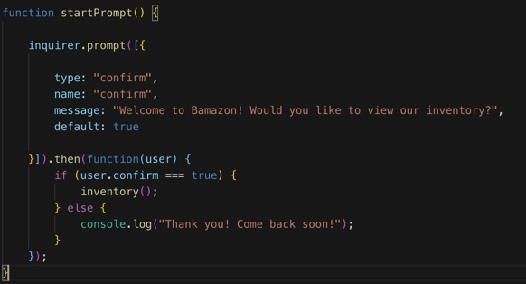

# Bamazon
In this activity, I created an Amazon-like storefront with the MySQL and node.

The Bamazon Customer App has an inventory of items stored onto a Bamazon database that I created. 

The app uses prompts to ask you which action you would like to take next. 
For example:
