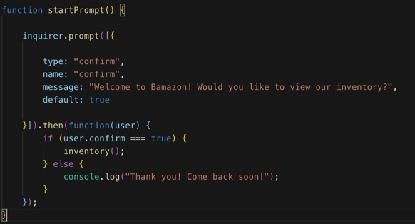
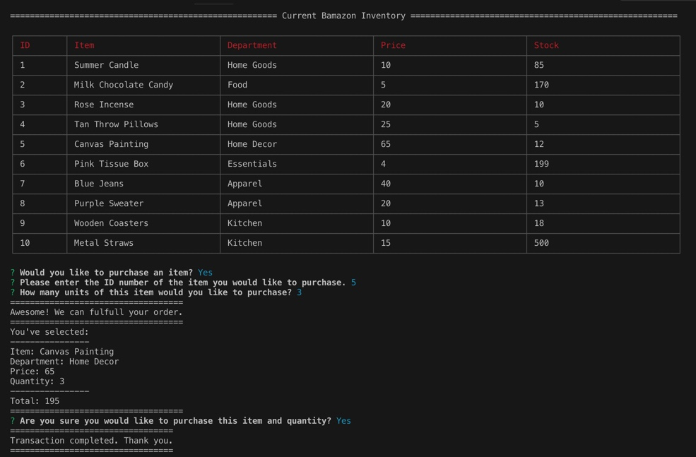

# Bamazon 
In this activity, I created an Amazon-like storefront with the MySQL and node.

The Bamazon Customer App has an inventory of items stored onto a Bamazon database that I created. 

The app uses prompts to ask you which action you would like to take next. 
For example:

When you select that you would like to purchase an item and the quanity, the database is instructed to calculate the price per item and give you an amount you have to pay for the items you would like to purchase. The database then updates the total stock amount that is left. 

# How to use this app:

Open the bamazonCustomer.js file in terminal.
Answer the questions that you are prompted to answer within the terminal.

-There is no deployed version of the app as it is a node application.